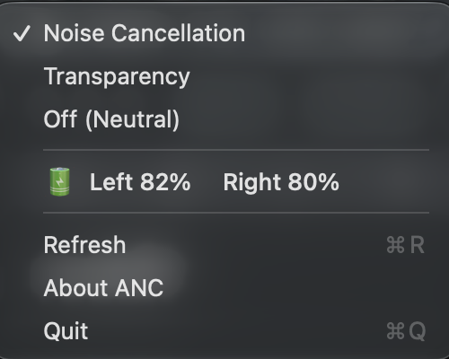

# gemini-anc

Control active noise cancellation on **Devialet Gemini II** earbuds from macOS,
over BLE — no phone app needed. A single Swift file talking to the Devialet
Audio GATT service.



## Requirements

- macOS 13 or later (Apple Silicon or Intel).
- **Devialet Gemini II** specifically. Other earbuds are not supported.
- Bluetooth on, and Bluetooth permission granted on first run (see below).

## Build

```sh
swiftc -O anc.swift -o anc
```

## Usage

```sh
anc on            # noise cancellation
anc off           # neutral
anc transparency  # let ambient sound through
anc status        # print the current mode + battery (left / right / case)
```

`anc status` reads the mode and all three battery levels over one connection, e.g.:

```
ANC on
left  34%
right 34%
case  0%
```

Bluetooth must be on and the buds powered/in range. First run scans for the
buds; later runs reconnect directly (see below).

## Menu-bar app

A tiny menu-bar front end that shells out to `anc`. Build it as a
double-clickable app:

```sh
./build-app.sh      # builds ANC.app with both binaries bundled
open ANC.app        # or just double-click it in Finder
```

Double-clicking ANC.app launches it straight into the menu bar — no Terminal,
no Dock icon. The menu-bar icon reflects the current mode, and the menu shows a
checkmark plus a battery line for both buds (low buds are flagged; the case level
is CLI-only, via `anc status`). A **Start at Login** item keeps it running across
reboots. Each action does a fresh BLE reconnect, so expect ~1.5–2.5s per click,
and the menu shows the reason when the buds can't be reached.

To run the front end bare instead: `swiftc -O ancbar.swift -o ancbar && ./ancbar`
(double-clicking the bare binary opens Terminal; the `.app` does not). It finds
the `anc` binary via `$ANC_BIN`, else the `anc` sibling next to it.

## Distribution (.dmg)

Download `ANC.dmg` from the [latest release](https://github.com/andiparker/gemini-anc/releases/latest),
open it, and drag **ANC** onto the Applications shortcut. The release build is
signed with a Developer ID and notarized by Apple, so it opens with no Gatekeeper
warning.

Build it yourself:

```sh
./build-dmg.sh      # builds ANC.app, then packages ANC.dmg (unsigned)
```

An unsigned local build opens fine on the machine that built it. To produce a
signed + notarized DMG, set your Developer ID identity and a stored `notarytool`
profile, then run the same script:

```sh
SIGN_ID="Developer ID Application: NAME (TEAMID)" NOTARY_PROFILE=<profile> ./build-dmg.sh
```

`SIGN_ID` signs the binaries and bundle with the hardened runtime; `NOTARY_PROFILE`
submits the DMG to Apple and staples the ticket. Create the profile once with
`xcrun notarytool store-credentials`. Both require a paid Apple Developer account.

## Troubleshooting

- **First run asks for Bluetooth access.** Grant it in the prompt, or later in System
  Settings → Privacy & Security → Bluetooth. Until granted, everything shows an error.
- **"Earbuds not found":** take the buds out of the case and make sure they aren't
  actively connected to your phone. A cold first find can take up to ~10s.
- **"Bluetooth is off":** turn Bluetooth on.
- The menu bar shows the specific reason (Bluetooth off, access needed, earbuds not
  found) rather than a generic failure.

## Running the CLI from the app

The `anc` CLI is bundled inside the app at `ANC.app/Contents/MacOS/anc`. To use it from
a terminal, symlink it onto your `PATH`:

```sh
ln -s "/Applications/ANC.app/Contents/MacOS/anc" /usr/local/bin/anc
```

## How it works

The buds don't advertise a name or service UUID, so the tool finds them by
Devialet's Bluetooth company id (`0x0258`) in the manufacturer data, connects to
the Audio service, and reads/writes the `CurrentAncConfiguration` characteristic
(`uint8`: `0` on / `1` off / `2` transparency).

After the first connect it caches the peripheral's UUID to `~/.anc-peer` and
reconnects to it directly on later runs, skipping the scan-for-advertisement
wait. Warm runs are ~1.5–2.5s versus ~8–13s cold. If the cached device is stale
or out of range, it falls back to a fresh scan.

## Notes

- macOS only (uses CoreBluetooth).
- Unofficial and unaffiliated with Devialet. Protocol found by inspection; may
  break with firmware changes.
